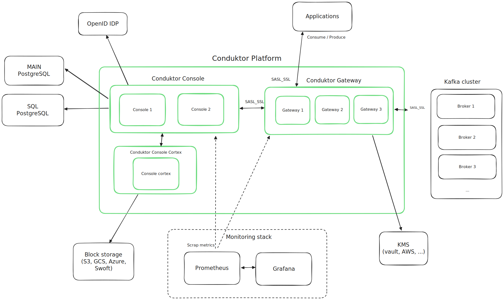

# Conduktor recommended architecture

This repository goal is to provide a **recommended architecture** for deploying Conduktor platform (Console and Gateway) in production ready environment that will match most of the needs.

## Start assumptions
- Target is Kubernetes using Helm (directly or through CD like FluxCD/ArgoCD)
- Kafka and Kubernetes are already setup and secured. 
  - Kubernetes components : Ingress controller / Load balancer / Storage class / Secret manager / cert-manager / ...
- Available S3 storage for Conduktor Console
- Available Postgres 13+ database for Conduktor Console
- Basic knowledge in networking/docker/kubernetes/certificates/kafka
- Need for maximum security
- Need for High Availability
- Sizing (cf dedicated section)

## Out of scope 
How to deploy/configure :
- Kafka cluster
- Kubernetes clusters with its components (ingress controller / load balancer / storage class / secret manager / ...) for production
- S3 storage
- Postgres server and databases

## General Recommended Architecture

Following diagram shows the general architecture of Conduktor platform and the required and optional components needed to deploy it in a production ready environment.

### Recommended/target production environment

The primary deployment target for the Conduktor platform is **Kubernetes** using **Helm**. For a production environment, the following recommendations and requirements should be followed to ensure high availability, security, and performance.

#### High Availability

- **Console and Gateway**: Deploy in a high availability configuration with at least 2 instances of Console. Could be scaled horizontally if needed. Note that `conduktor-console-cortex` only supports a single instance.
- **Gateway**: Deploy in a high availability configuration with 3 instances. Could be scaled horizontally if needed.
- **Redundancy**: Ensure redundancy for critical components such as databases and storage.

#### Persistence

- **Storage**: 
  - Conduktor **Console** container don't require persistent storage and only use volumes for settings and some startup logs. So default ephemeral storage with at least 2Go size is enough.
  - Conduktor **Gateway** container don't require persistent storage by default except if using Large Message/Batch handling interceptor that use local storage volume to cache data. In this case, use a fast storage sized for the volume of data you want to cache.
  - Conduktor **Console Cortex** container use a local storage as hot cache before offloading metrics segments to configured **object storage**. So default ephemeral storage with at least 10Go size is enough.
- **Database**: Use a managed PostgreSQL database with high availability and backups. For self-hosted databases, use a PostgreSQL cluster with replication and backups.
  - Console main database should start with a minimum of 10Go size and can be increased based on usage (number of users/groups/Kafka clusters, topics and consumer groups).
  - Optional Console SQL database should start with a minimum of 10Go size and can be increased based on usage (number of topics to index and retention period).

#### Security

- **TLS/SSL**: All Conduktor components should be exposed securely using TLS. The Console should be accessible via `https`, and the Gateway should use `https` for the admin API and `SASL_SSL` for Kafka clients. Certificates can be managed by [**cert-manager**](https://cert-manager.io/docs/).
- **Kubernetes Secrets**: Store all sensitive data (passwords, API tokens, access keys) using Kubernetes Secrets, ideally managed by a secret manager like Vault.
- **SSO**: Create a root account on the Console with a strong password and use Single Sign-On (SSO) for user management. Preferred SSO solution is **OIDC** with discovery rather than **LDAP**.
- **Kafka Authentication and Authorization**: Use `SASL_SSL` for Kafka authentication with mechanisms like `PLAIN`, `SCRAM-SHA`, `OAUTHBEARER`, or `KERBEROS`. For authorization, use ACLs with a dedicated user for Conduktor Gateway.
- **Conduktor Gateway Authentication and Authorization**: For extra layer of security use Gateway managed mode security with `SASL_SSL` and Gateway ACLs with service accounts.  
- **Pod/Container Security Context**: Run container with a non-root user, in non-privileged mode and use read-only filesystems where possible.

#### Monitoring and Logging

- **Prometheus and Grafana**: Use Prometheus for monitoring and Grafana for visualization. Use built-in dashboards for Conduktor components in Helm charts.
- **Alerting**: Set up alerting rules in Prometheus for critical Pods metrics (e.g., CPU, memory, disk usage, error rates). In future, built in alerts for Conduktor Console and Gateway will be packaged with Helm charts.
- **Structured Logging**: Enable JSON structured logging for all components to enable easy parsing and analysis. See [Console](https://docs.conduktor.io/platform/get-started/troubleshooting/logs-configuration/#structured-logging-json) and [Gateway](https://docs.conduktor.io/gateway/configuration/env-variables/#logging) documentation.
- **Log Management**: Implement centralized logging using tools like ELK stack (Elasticsearch, Logstash, Kibana) or Fluentd or Splunk.
- **Audit Logs**: Configure audit logs export to Kafka topics for all components to track user activity and changes. See [Console](https://docs.conduktor.io/platform/guides/configure-audit-log-topic/) and [Gateway](https://docs.conduktor.io/gateway/configuration/env-variables/#audit) documentation.

#### Backup and Recovery

- **Database Backups**: Back up Console PostgreSQL databases regularly and before an upgrade. 
  - We recommend using managed PostgreSQL backups for production environments. Or automate backups using tools like `pg_dump` or `pg_basebackup`.
- **Storage Backups**: Ensure backups for S3-compatible storage (e.g., MinIO).

#### Performance and Scalability

- **Resource Requests and Limits**: Define resource requests and limits for all components to ensure proper resource allocation and prevent resource contention. See [sizing](./sizi ng.md) for more details.
- **Main Database Sizing**: Size the main PostgreSQL database based on the expected data volume and usage (numbers of users/groups, Kafka clusters, topics and consumer group). See [sizing](./sizing.md) for more details.
- **SQL Database Sizing**: Size the SQL PostgreSQL database based on the expected usage of the SQL feature and size of topics to index for given retention period. See [sizing](./sizing.md) for more details.

#### Networking

- **Ingress Controller**: Use an Ingress controller (e.g., NGINX) to manage external access to the services.
- **Load Balancer**: Deploy a load balancer to distribute traffic across multiple instances of the Console and Gateway.
- [**SNI Routing**](https://docs.conduktor.io/gateway/how-to/sni-routing/#setting-up-sni-routing): Use SNI routing for Gateway to route traffic based on the hostname.

#### Auditing

- **Audit Logs**: Enable export of audit logs to [Kafka topics](https://docs.conduktor.io/platform/guides/configure-audit-log-topic/) to track user activity.

#### Provisioning

- [**Terraform**](https://github.com/conduktor/terraform-provider-conduktor) and [**Conduktor CLI**](https://github.com/conduktor/ctl): Until Terraform provider is feature complete, use a mix of Terraform and Conduktor CLI to provision the platform.
- **Authentication**: Use API tokens with required permissions for authentication with the Terraform provider and Conduktor CLI. (e.g Application token for self-service teams provisioning and admin root token for admin resources)

#### Dependencies

- **PostgreSQL**: Use PostgreSQL 13+ as the database for Conduktor Console with **TLS**, **HA** and backup in place.
- **S3-Compatible Storage**: Use S3-compatible storage (e.g., AWS S3, GCS, Minio, ...) for Conduktor Console.
- **Kafka**: Use Kafka 2.5+ and ensure that it is configured and secured with the necessary authentication and authorization mechanisms. With a dedicated user for Conduktor Gateway that can at minimum manage topic/consumer group/commit offsets and describe cluster.
- **OIDC Provider**: Use an OIDC provider for Single Sign-On (SSO) with Conduktor Console.
- **KMS**: Use a Key Management Service (KMS) like **HashiCorp Vault** for [Gateway encryption and decryption](https://docs.conduktor.io/gateway/interceptors/data-security/encryption/encryption-configuration/) of Kafka messages.

By following these recommendations and requirements, you can ensure a robust, secure, and scalable production environment for the Conduktor platform.

### Examples
- [**Local Stack**](local-stack/README.md): Local stack for Conduktor platform with all components deployed in a K3D cluster.
