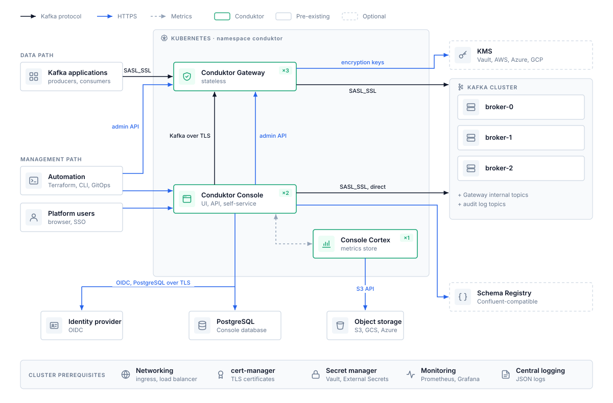

# Conduktor recommended architecture

This repository goal is to provide a **recommended architecture** for deploying Conduktor platform (Console and Gateway) in production ready environment that will match most of the needs.

## Start assumptions
- Target is Kubernetes using Helm (directly or through CD like FluxCD/ArgoCD)
- Kafka and Kubernetes are already setup and secured. 
  - Kubernetes components : Ingress controller / Load balancer / Storage class / Secret manager / cert-manager / ...
- Available object storage for Conduktor Console Cortex
- Available Postgres 13+ database for Conduktor Console
- Basic knowledge in networking/docker/kubernetes/certificates/kafka
- Need for maximum security
- Need for High Availability
- Sizing: see [sizing](./sizing.md)

## Out of scope 
How to deploy/configure :
- Kafka cluster
- Kubernetes clusters with its components (ingress controller / load balancer / storage class / secret manager / ...) for production
- Object storage
- Postgres server and databases

## General Recommended Architecture

Following diagram shows the general architecture of Conduktor platform and the required and optional components needed to deploy it in a production ready environment.

### Recommended/target production environment

The primary deployment target for the Conduktor platform is **Kubernetes** using **Helm**. For a production environment, the following recommendations and requirements should be followed to ensure high availability, security, and performance.

#### High Availability

- **Console**: Run at least 2 instances. Instances share the same PostgreSQL database and one of them is elected leader for indexing. Scale horizontally if needed. `conduktor-console-cortex` only supports a single instance.
- **Gateway**: Run at least 3 instances. Scale horizontally if needed.
- **Redundancy**: Ensure redundancy for critical components such as databases and storage.

#### Persistence

- **Storage**: 
  - Conduktor **Console** is stateless: its state lives in PostgreSQL. Ephemeral storage is enough, with at least 5 GB (10 GB recommended). See [system requirements](https://docs.conduktor.io/guide/conduktor-in-production/system-requirements).
  - Conduktor **Gateway** doesn't use local storage itself, but some interceptors do. [Large message handling](https://docs.conduktor.io/guide/use-cases/manage-large-messages#local-disk-cache) offloads payloads to S3 or Azure Blob and keeps a local disk cache with no size limit: mount a persistent volume sized for the expected payload volume. The caching interceptor also writes to local disk. Large batch handling was removed in Gateway 3.21.
  - Conduktor **Console Cortex** uses a local volume as a working area before offloading metric blocks to **object storage**. Without object storage, all metrics are lost when the container restarts. Use a `ReadWriteOnce` persistent volume with `updateStrategy: Recreate`, never `ReadWriteMany`. See [Cortex deployment](https://docs.conduktor.io/guide/conduktor-in-production/deploy-artifacts/deploy-cortex).
- **Database**: Use a managed PostgreSQL database with high availability and backups. For self-hosted databases, use a PostgreSQL cluster with replication and backups.
  - Size the Console database with the [PostgreSQL sizing guide](https://docs.conduktor.io/guide/conduktor-in-production/deploy-artifacts/deploy-console/postgres-sizing). 10 GB only fits a proof of concept; production starts at 50 GB and grows with users, Kafka clusters, topics and consumer groups.

#### Security

- **TLS/SSL**: All Conduktor components should be exposed securely using TLS. The Console should be accessible via `https`, and the Gateway should use `https` for the admin API and `SASL_SSL` for Kafka clients. Certificates can be managed by [**cert-manager**](https://cert-manager.io/docs/).
- **Kubernetes Secrets**: Store all sensitive data (passwords, API tokens, access keys) using Kubernetes Secrets, ideally managed by a secret manager like Vault.
- **SSO**: Create a root account on the Console with a strong password and use Single Sign-On (SSO) for user management. This reference recommends **OIDC** with discovery over **LDAP**.
- **Kafka Authentication and Authorization**: Use `SASL_SSL` for Kafka authentication with mechanisms like `PLAIN`, `SCRAM-SHA-256`/`SCRAM-SHA-512`, `OAUTHBEARER`, `GSSAPI` (Kerberos) or `AWS_MSK_IAM`. For authorization, use ACLs with dedicated users for Conduktor Gateway and for Conduktor Console.
- **Conduktor Gateway Authentication and Authorization**: For extra layer of security use Gateway managed mode security with Gateway ACLs and service accounts. Give each Gateway [listener](https://docs.conduktor.io/guide/tutorials/multi-listener) a single authentication method, for example `SSL` with `sslClientAuth: REQUIRE` (mTLS) on an internal listener and `SASL_SSL` on an external one, rather than requiring clients to present both a certificate and a SASL credential on the same endpoint. All SASL listeners share the same set of SASL mechanisms: you can't restrict one listener to `OAUTHBEARER` only.
- **Pod/Container Security Context**: Run container with a non-root user, in non-privileged mode and use read-only filesystems where possible.

#### Monitoring and Logging

- **Prometheus and Grafana**: Use Prometheus for monitoring and Grafana for visualization. Use built-in dashboards for Conduktor components in Helm charts.
- **Alerting**: Set up alerting rules in Prometheus for critical Pods metrics (e.g., CPU, memory, disk usage, error rates). The Gateway Helm chart ships default `PrometheusRule` alerts (`metrics.alerts.enable`, off by default). The Console chart doesn't ship alerts yet.
- **Structured Logging**: Enable JSON structured logging for all components to enable easy parsing and analysis. See [Console](https://docs.conduktor.io/guide/conduktor-in-production/deploy-artifacts/deploy-console/sample-configuration#json-structured-logging) and [Gateway](https://docs.conduktor.io/guide/conduktor-in-production/deploy-artifacts/deploy-gateway/environment-variables#logging) documentation.
- **Log Management**: Implement centralized logging using tools like ELK stack (Elasticsearch, Logstash, Kibana) or Fluentd or Splunk.
- **Audit Logs**: Configure audit logs export to Kafka topics for all components to track user activity and changes. See [Console](https://docs.conduktor.io/guide/tutorials/configure-audit-log-topic) and [Gateway](https://docs.conduktor.io/guide/conduktor-in-production/deploy-artifacts/deploy-gateway/environment-variables#audit) documentation.

#### Backup and Recovery

- **Database Backups**: Back up the Console PostgreSQL database regularly and before an upgrade.
  - We recommend using managed PostgreSQL backups for production environments. Or automate backups using tools like `pg_dump` or `pg_basebackup`.
- **Storage Backups**: Ensure backups for the Cortex object storage bucket.

#### Performance and Scalability

- **Resource Requests and Limits**: Define resource requests and limits for all components to ensure proper resource allocation and prevent resource contention. See [sizing](./sizing.md) for more details.
- **Database Sizing**: Size the Console PostgreSQL database based on the expected data volume and usage (numbers of users/groups, Kafka clusters, topics and consumer group). See [sizing](./sizing.md) for more details.

#### Networking

- **Ingress Controller**: Use an Ingress controller (e.g., NGINX) to manage external access to the services.
- **Load Balancer**: Deploy a load balancer to distribute traffic across multiple instances of the Console and Gateway.
- [**SNI Routing**](https://docs.conduktor.io/guide/tutorials/sni-routing#set-up-sni-routing): Use SNI routing for Gateway to route traffic based on the hostname.

#### Provisioning

- [**Terraform**](https://github.com/conduktor/terraform-provider-conduktor) and [**Conduktor CLI**](https://github.com/conduktor/ctl): Until Terraform provider is feature complete, use a mix of Terraform and Conduktor CLI to provision the platform.
- **Authentication**: Use [API keys](https://docs.conduktor.io/guide/conduktor-in-production/automate/terraform-automation) with the Terraform provider and Conduktor CLI: an application API key for self-service resources, scoped to its application instance, and an admin API key only for admin resources.

#### Dependencies

- **PostgreSQL**: Use PostgreSQL 13+ (14.8+ or 15.3+ on AWS RDS and Aurora) as the database for Conduktor Console with **TLS**, **HA** and backup in place.
- **Object Storage**: Use object storage for Conduktor Console Cortex: AWS S3 or S3-compatible (e.g., MinIO), GCS, Azure Blob Storage or Swift.
- **Kafka**: Use Kafka 2.7.0+ and ensure that it is configured and secured with the necessary authentication and authorization mechanisms. Create a dedicated user for Conduktor Gateway with the [ACLs it needs](https://docs.conduktor.io/guide/conduktor-in-production/deploy-artifacts/deploy-gateway/connect-to-kafka) on its internal topics, consumer group and the topics it proxies. Create another one for Conduktor Console with the [required Kafka permissions](https://docs.conduktor.io/guide/conduktor-in-production/admin/configure-clusters#required-kafka-permissions).
- **OIDC Provider**: Use an OIDC provider for Single Sign-On (SSO) with Conduktor Console.
- **KMS**: Use a Key Management Service (HashiCorp Vault, AWS KMS, Azure Key Vault, GCP KMS or Fortanix) for [Gateway encryption and decryption](https://docs.conduktor.io/guide/reference/data-security#kms-configuration) of Kafka messages. The in-memory KMS is for testing only.

### Examples
- [**Local Stack**](local-stack/README.md): Local stack for Conduktor platform with all components deployed in a K3D cluster.
