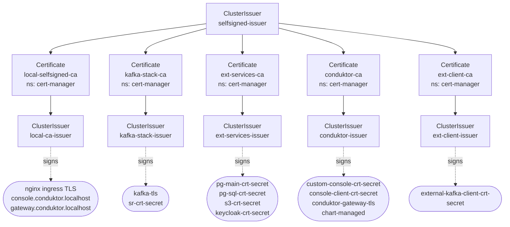
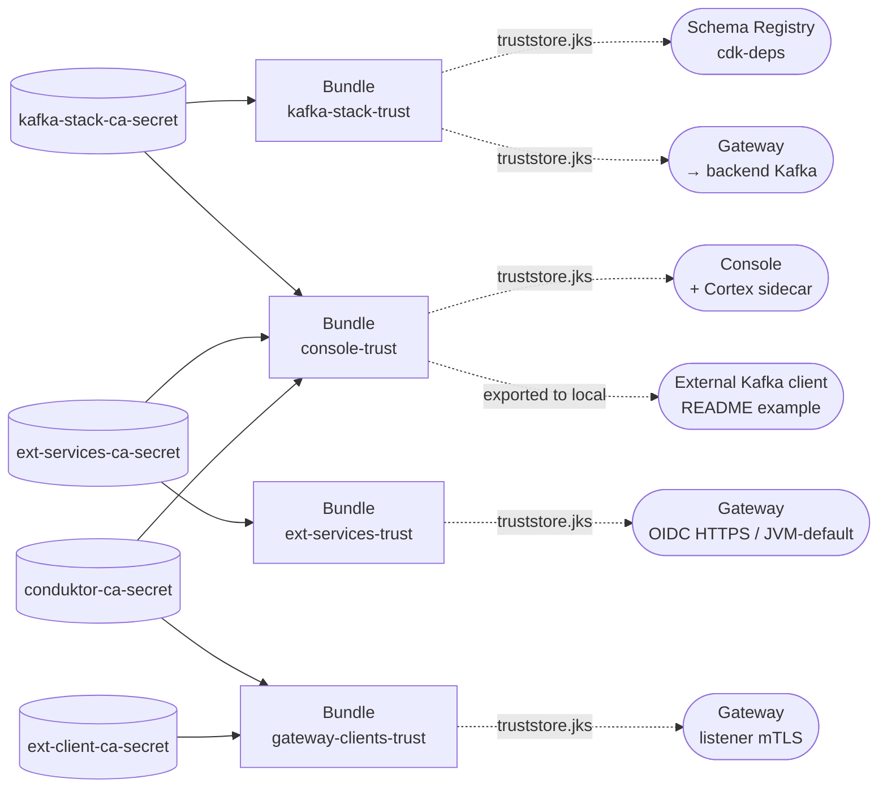

# Certificate & Trust Architecture

This document describes the PKI layout used by the local-stack: how CAs are
organised, which leaf certificates are issued under each CA, and how trust is
composed and distributed via [trust-manager](https://cert-manager.io/docs/trust/trust-manager/)
`Bundle` resources.

The goal is to mirror a **production-like** setup where each external service
brings its own CA. In this local stack every CA is self-signed for simplicity,
but the structure is identical to what you'd get if your DB provider, IdP, and
Kafka provider each handed you a different CA in real life.

## Why per-service CAs?

A single shared CA would mean *every* truststore trusts *everything*. Splitting
CAs by trust domain lets each component trust only what it actually needs
(least-privilege principle):

- Schema Registry only needs to trust the Kafka brokers.
- Gateway needs three separate trust contexts (clients, backend Kafka, OIDC).
- Console needs broad trust (it talks to PG, Keycloak, S3, SR, Gateway).
- External Kafka clients only need to trust Gateway + the OIDC IdP.

## CA hierarchy



**`selfsigned-issuer`** is the bootstrap root. It only exists so cert-manager
can sign the five self-signed CA Certificates. In real prod each CA below
would be supplied externally (by your IdP, let'sencrypt, DB provider, Kafka provider, etc.)
and you would not have `selfsigned-issuer` at all.

**`local-ca-issuer`** is kept as a catch-all for the nginx ingress TLS certs
(`cert-manager.io/cluster-issuer: local-ca-issuer` annotation on the Console
and Gateway ingresses). The application-level certs all use the per-service
issuers below.

## Per-issuer leaf certificates

| Issuer | Leaf Secret (namespace) | Used by |
|---|---|---|
| `local-ca-issuer` | nginx ingress cert (auto-managed by cert-manager) | Console + Gateway HTTPS ingress |
| `kafka-stack-issuer` | `kafka-tls` (cdk-deps) | Kafka brokers (bitnami autoGenerated) |
| `kafka-stack-issuer` | `sr-crt-secret` (cdk-deps) | Schema Registry HTTPS server cert |
| `ext-services-issuer` | `pg-main-crt-secret`, `pg-sql-crt-secret` (cdk-deps) | PostgreSQL TLS |
| `ext-services-issuer` | `s3-crt-secret` (cdk-deps) | MinIO S3 TLS |
| `ext-services-issuer` | `keycloak-crt-secret` (cdk-deps) | Keycloak OIDC HTTPS |
| `conduktor-issuer` | `custom-console-crt-secret` (conduktor) | Console HTTPS server cert |
| `conduktor-issuer` | `console-client-crt-secret` (conduktor) | Console mTLS client cert → Gateway |
| `conduktor-issuer` | `conduktor-gateway-tls` (conduktor, chart-managed) | Gateway listener server cert |
| `ext-client-issuer` | `external-kafka-client-crt-secret` (conduktor) | External Kafka client cert (README example) |

## Trust composition (trust-manager Bundles)

Each Bundle picks a subset of the CA secrets from `cert-manager` namespace,
aggregates their `ca.crt` into a PEM + JKS (password `conduktor`), and
distributes the resulting Secret to every namespace labeled
`trust-bundle: enabled` (today `cdk-deps` + `conduktor`).



| Bundle | Sources | Consumers |
|---|---|---|
| `kafka-stack-trust` | kafka-stack-ca | SR kafkastore client, Gateway backend Kafka |
| `gateway-clients-trust` | conduktor-ca, ext-client-ca | Gateway listener mTLS (`sslClientAuth: REQUIRE`) |
| `ext-services-trust` | ext-services-ca | Gateway HTTPS calls (OIDC JWKS) + JVM-default truststore |
| `console-trust` | kafka-stack-ca, ext-services-ca, conduktor-ca | Console (one mount for all outgoing TLS), and reused for the README external-client `truststore.jks` |

## Mount points by workload

### Gateway (three distinct trust domains)

| Concern | Source | Mount path | Env var |
|---|---|---|---|
| Listener server cert | chart-managed (`tls.certManager.enabled`) | `/etc/gateway/tls/keystore.jks` | auto |
| Listener mTLS truststore | `gateway-clients-trust` Bundle | `/etc/conduktor/tls/listener-trust/truststore.jks` | `GATEWAY_SSL_TRUST_STORE_PATH` |
| Backend Kafka truststore | `kafka-stack-trust` Bundle | `/etc/conduktor/tls/kafka-trust/truststore.jks` | `KAFKA_SSL_TRUSTSTORE_LOCATION` |
| OIDC HTTPS / JVM default | `ext-services-trust` Bundle | `/etc/conduktor/tls/ext-services-trust/truststore.jks` | `JAVA_TOOL_OPTIONS` |

`tls.certManager.truststore.enabled` is set to `false` on the Gateway chart so
the chart does not mount its own truststore — we control all three via our
own volumes.

### Console (single broad truststore)

| Concern | Source | Mount path | Env var |
|---|---|---|---|
| Console server cert | `custom-console-crt-secret` (chart `config.platform.https.existingSecret`) | mounted by chart | auto |
| Client cert (mTLS to Gateway) | `console-client-crt-secret` | `/opt/conduktor/ssl/client/keystore.jks` | per-cluster `ssl.keystore.location` (terraform) |
| Outgoing TLS truststore | `console-trust` Bundle | `/opt/conduktor/ssl/truststore.jks` | `CDK_SSL_TRUSTSTORE_PATH` |

### Schema Registry

| Concern | Source | Mount path |
|---|---|---|
| Server cert + truststore | `sr-crt-secret` (cert-manager keystores.jks) | `/etc/schema-registry/secrets/sr-tls/` |
| Kafka client truststore | `kafka-stack-trust` Bundle | `/etc/schema-registry/secrets/kafka-tls/truststore.jks` |

### External Kafka client (README example)

The local CLI uses the same Bundle as Console:

| File | Source | Notes |
|---|---|---|
| `truststore.jks` | `console-trust` Bundle (exported by [01-start.sh](01-start.sh)) | Trusts Gateway (conduktor-ca) and OIDC (ext-services-ca) |
| `keystore.jks` | `external-kafka-client-crt-secret` (exported by [01-start.sh](01-start.sh)) | Presented to Gateway listener mTLS |

## Adding a new external CA

Say in prod your Kafka cluster is operated by a third party that ships its own
CA cert as `confluent-cloud-ca.pem`. To add it to the local stack:

1. Drop the PEM into a Secret in the `cert-manager` namespace:
   ```bash
   kubectl create secret generic confluent-cloud-ca \
     -n cert-manager \
     --from-file=ca.crt=./confluent-cloud-ca.pem
   ```
2. Append a `source` to the `kafka-stack-trust` Bundle in
   [02-infra-crds.yaml](k3d-stack/02-infra-crds.yaml):
   ```yaml
   sources:
     - secret:
         name: kafka-stack-ca-secret
         key: ca.crt
     - secret:
         name: confluent-cloud-ca
         key: ca.crt   # new
   ```
3. trust-manager merges them automatically; SR + Gateway pick up the new
   truststore via volume refresh.

The same pattern works for `inLine:` PEM payloads if you want the CA inlined
in the manifest. trust-manager always dedupes on certificate fingerprint, so
adding a CA that's already present is a no-op.
