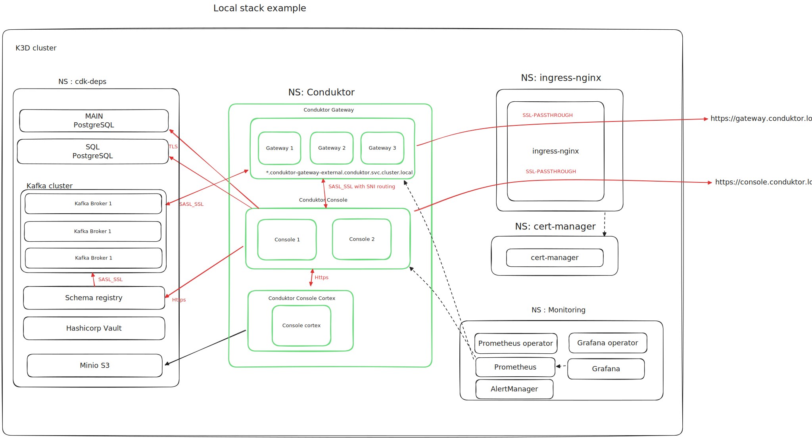

# Local example with K3D

The goal of this example is to provide an examples of values/secrets needed to deploy Conduktor platform in a "production like" environment with all security constraints and high availability.



This local example will deploy a local kubernetes cluster using K3D and install components that mimic the production environment.
Components installed :
- Kubernetes components :
    - Nginx ingress controller for ingress management
    - Cert-manager to manage certificates with a self-signed CA issuer
    - Monitoring stack with Prometheus operator and Grafana operator
- Conduktor dependencies components :
    - 2 Postgresql database
        - Main database for Conduktor Console data
        - Optional SQL database for Conduktor Console SQL feature
    - Kafka cluster with 3 brokers
    - Hashicorp Vault to provide a KMS service
- Conduktor platform :
    - Conduktor Console in HA (2 instances) with Cortex sidecar
    - Conduktor Gateway in HA (2 instances)

## Prerequisites
- Docker
- [K3D](https://k3d.io/stable/#releases)
- Terraform
- [Yq](https://mikefarah.gitbook.io/yq) v4.x
- Conduktor License in `LICENSE` environment variable set.

## 1. Create cluster with base components

To create and start the local environment, run the following commands :
```bash
make start-local-stack
```
It will create a K3d cluster named k3d-conduktor-platform-p75 and install base components (Ingress controller, Cert-manager, Monitoring stack, Postgresql databases, Kafka cluster, Vault).
Kubectl context should be created. To use it run `kubectl config use-context k3d-conduktor-platform-p75`.

## 2. Deploy Conduktor platform
Then, to install Conduktor Console and Gateway, run the following commands :
```bash
make install-conduktor-platform
```
It will deploy [`console-secrets`](local-stack/console-secrets.yaml) and [`gateway-secrets`](local-stack/gateway-secrets.yaml) into `conduktor` namespace and
then install both Conduktor Console and Gateway latest helm charts using [`console-values`](local-stack/console-values.yaml) and [`gateway-values`](local-stack/console-values.yaml) files.

## 3. Access Conduktor platform
Add the following line to your `/etc/hosts` file :
```
127.0.0.1 console.conduktor.localhost oidc.localhost
127.0.0.1 gateway.conduktor.localhost
127.0.0.1 brokermain0.gateway.conduktor.localhost brokermain1.gateway.conduktor.localhost brokermain2.gateway.conduktor.localhost
```
You can then access Conduktor Console at [https://console.conduktor.localhost](https://console.conduktor.localhost) and Conduktor Gateway at [https://gateway.conduktor.localhost](https://gateway.conduktor.localhost).

You can then login using the following credentials :

| Account Type   | Username                                     | Password   | Groups    | 
|----------------|----------------------------------------------|------------|-----------|
| local          | admin@company.io                             | adminP4ss! | admin     |
| sso (keycloak) | conduktor-admin / conduktor-admin@company.io | conduktor  | admin     |
| sso (keycloak) | alice / alice@company.io                     | alice      | project-a |
| sso (keycloak) | bob / alice@company.io                       | bob        | project-b |     

You can also manage OIDC keycloak server at [https://oidc.localhost](https://oidc.localhost) with the following credentials `admin` / `conduktor`.

## 4. Provision Conduktor platform using terraform

To provision the Conduktor platform using terraform, run the following commands :
```bash
make init-conduktor-platform
```
Provisioning create resources inside Conduktor Console and Gateway.

## 5. Destroy Conduktor platform local stack

To destroy the Conduktor platform, run the following commands :
```bash
make stop-local-stack
```