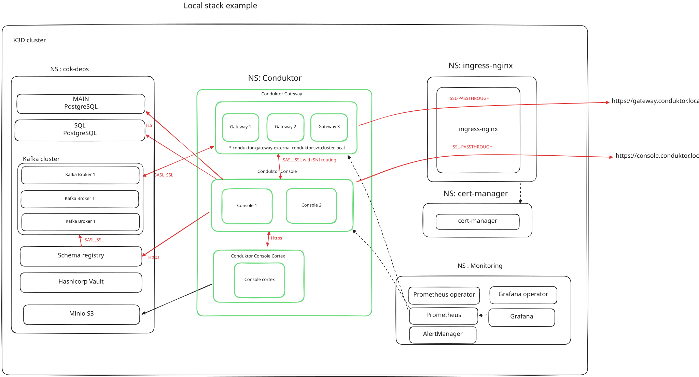

# Local example with K3D

The goal of this example is to provide an examples of values/secrets needed to deploy Conduktor platform in a "production like" environment with all security constraints and high availability.



This local example will deploy a local kubernetes cluster using K3D and install components that mimic the production environment.
Components installed :

- Kubernetes components :
  - **Nginx ingress controller** for ingress management
  - **Cert-manager** to manage certificates with a self-signed CA issuer
  - Monitoring stack with **Prometheus operator** and **Grafana operator**
- Conduktor dependencies components :
  - 2 **Postgresql** database
    - Main database for Conduktor Console data
    - Optional SQL database for Conduktor Console SQL feature
  - **Kafka** cluster with 3 brokers
  - **Hashicorp Vault** to provide a KMS service
  - **Keycloak** OIDC server for SSO authentication
- Conduktor platform :
  - **Conduktor Console** in HA (2 instances) with Cortex sidecar
  - **Conduktor Gateway** in HA (2 instances)

## Prerequisites

- Docker
- [K3D](https://k3d.io/stable/#releases)
- Terraform
- [Yq](https://mikefarah.gitbook.io/yq) v4.x
- Conduktor License is set in the `LICENSE` environment variable of the active shell or is present in the `.env` file
- Kafka CLI commands (e.g. `brew install kafka`)

### Hardware requirements

- Minimum 4 CPUs available
- Minimum 10GB of RAM available
- Minimum 15GB of disk space available

## Create DNS entries

Add  following lines to your `/etc/hosts` file in order to resolve hostnames:

```properties
127.0.0.1 console.conduktor.localhost
127.0.0.1 oidc.localhost
127.0.0.1 gateway.conduktor.localhost brokermain.gateway.conduktor.localhost brokermain0.gateway.conduktor.localhost brokermain1.gateway.conduktor.localhost brokermain2.gateway.conduktor.localhost
```

k3d will pick up data from localhost (127.0.0.1) on ports 443 and 9092. The Ingresses we deploy will route to services based on these hostnames.

## Create cluster with base components

To create and start the local environment, run the following commands :

```bash
make start-local-stack
```

It will create a K3d cluster named k3d-conduktor-platform-p75 and install base components (Ingress controller, Cert-manager, Monitoring stack, Postgresql databases, Kafka cluster, Vault).
Kubectl context should be created. To use it, run

```bash
kubectl config use-context k3d-conduktor-platform-p75
```

## Deploy Conduktor platform

Ensure a Conduktor license is set in the `.env` file, or active shell.
You can use `.env.template` file as a template to create your own `.env` file.

Then, to install Conduktor Console and Gateway, run the following commands :

```bash
make install-conduktor-platform
```

It will deploy [`console-secrets`](local-stack/console-secrets.yaml) and [`gateway-secrets`](local-stack/gateway-secrets.yaml) into `conduktor` namespace and
then install both Conduktor Console and Gateway latest helm charts using [`console-values`](local-stack/console-values.yaml) and [`gateway-values`](local-stack/console-values.yaml) files.

## Provision Conduktor platform using terraform

To provision the Conduktor platform using terraform, run the following commands :

```bash
make init-conduktor-platform
```

Provisioning create resources inside Conduktor Console and Gateway.

> NOTE: This reference uses Terraform, but you can also manage Conduktor resources via the [Conduktor CLI](https://docs.conduktor.io/guide/conduktor-in-production/automate/cli-automation). The CLI can be [enabled with state](https://docs.conduktor.io/guide/conduktor-in-production/automate/cli-automation#manage-state) to behave similarly to Terraform. There are [Gateway yaml resources](https://docs.conduktor.io/guide/reference/gateway-reference) and [Console yaml resources](https://docs.conduktor.io/guide/reference/console-reference) that can be managed with the CLI. 

### Conduktor Console

You can then access Conduktor Console at [https://console.conduktor.localhost](https://console.conduktor.localhost) 

You can then login using the following credentials :

| Account Type   | Username                                     | Password   | Groups    |
|----------------|----------------------------------------------|------------|-----------|
| local          | admin@demo.dev                               | adminP4ss! | admin     |
| sso (keycloak) | conduktor-admin / conduktor-admin@company.io | conduktor  | admin     |
| sso (keycloak) | alice / alice@company.io                     | alice      | project-a |
| sso (keycloak) | bob / alice@company.io                       | bob        | project-b |

You will be able to create topics and otherwise interact with both Kafka Cluster and Conduktor Gateway.

Each Gateway listener uses a single authentication method — customers rarely want clients to juggle both a
certificate and a SASL credential on the same endpoint:

| Listener | Port | Authentication | Clients |
|---|---|---|---|
| `internal` | 9093 | mTLS (`SSL`, `sslClientAuth: REQUIRE`) | Conduktor Console |
| `external` | 9092 | SASL over one-way TLS, `OAUTHBEARER` or `PLAIN` | Kafka clients outside the cluster |

Console connects on the internal listener with a client certificate issued by cert-manager. Gateway derives the
principal from the certificate CN (`GATEWAY_SSL_PRINCIPAL_MAPPING_RULES`), so the `console-sa` and `client-sa`
certificates map to the EXTERNAL Gateway service accounts of the same name.

The external listener offers both SASL mechanisms, which is how you onboard apps that live in different worlds:

| Service account | Type | Mechanism | Credential comes from | Authorization |
|---|---|---|---|---|
| `app-1` | `EXTERNAL` | `OAUTHBEARER` | Keycloak, matched on the `azp` claim | superuser |
| `app-2` | `LOCAL` | `PLAIN` | a token Gateway issues and signs itself | Kafka ACLs |

`LOCAL` accounts are useful when an app has no IdP client of its own — Gateway becomes the credential authority
for it.

`app-1` is a superuser, which is the shortest path to a working example but bypasses authorization entirely.
`app-2` is deliberately left out of `GATEWAY_SUPER_USERS` so its ACLs are enforced; terraform grants it
`Describe`/`Read`/`Write` on the `website-analytics.` topic prefix and nothing else
(`provisioning/modules/04-console-service-accounts`). Those ACLs are declared against the Console cluster and
land in the Gateway virtual cluster behind it, so they apply on whichever listener the client connects to.

### Conduktor Gateway

You can reach the Conduktor Gateway Admin API at [https://gateway.conduktor.localhost](https://gateway.conduktor.localhost) with authentication `admin`/`adminP4ss!`.

```bash
curl -k -u admin:adminP4ss! \
    'https://gateway.conduktor.localhost/gateway/v2/interceptor'
```

You can reach Kafka through Gateway using SASL OAuthbearer (see client.properties file). Here we assume `kafka-topics` is installed locally and is running Apache Kafka version 4 or greater.

```bash
# Need to set truststore at the JVM level to authenticate with OIDC
export KAFKA_OPTS="-Djava.security.manager=allow \
-Djavax.net.ssl.trustStore=./truststore.jks \
-Djavax.net.ssl.trustStorePassword=conduktor \
-Dorg.apache.kafka.sasl.oauthbearer.allowed.urls=https://oidc.localhost/realms/conduktor-realm/protocol/openid-connect/token"
```

```bash
kafka-topics --list \
    --bootstrap-server gateway.conduktor.localhost:9092 \
    --command-config client.properties
```

Alternatively, to run a Kafka client on an older version, you can use this docker command:

```bash
docker run --rm --network host \
  -e KAFKA_OPTS="-Djavax.net.ssl.trustStore=/tmp/truststore.jks -Djavax.net.ssl.trustStorePassword=conduktor" \
  -v $PWD/truststore.jks:/tmp/truststore.jks \
  -v $PWD/client_pre_ak4.properties:/tmp/client.properties \
  apache/kafka:3.8.0 /opt/kafka/bin/kafka-topics.sh \
    --bootstrap-server gateway.conduktor.localhost:9092 \
    --command-config /tmp/client.properties \
    --list
```

> `client_pre_ak4.properties` differs only in how the OAuth credentials are
> passed. Clients on Kafka 4.1 or later read them from
> `sasl.oauthbearer.client.credentials.client.id` / `.client.secret`; older
> clients only understand them inside `sasl.jaas.config`.

> The external listener uses one-way TLS (`sslClientAuth: NONE`), so clients
> only need `truststore.jks`, exported to this directory by
> `make start-local-stack`.

#### Connecting with a Gateway-managed service account

The same listener accepts SASL/PLAIN, using a token Gateway issues for a `LOCAL` service account. Because that
token only exists once `make init-conduktor-platform` has run, terraform renders the client config for you at
`client_plain.properties` (gitignored — it holds a live credential):

```bash
kafka-topics --list \
    --bootstrap-server gateway.conduktor.localhost:9092 \
    --command-config client_plain.properties
```

No `KAFKA_OPTS` this time: PLAIN needs no call out to the IdP, so the truststore in the properties file is
enough.

This is also where the ACLs become visible. `app-2` only holds `Describe` on the `website-analytics.` prefix,
so that is all the listing contains:

```
website-analytics.dev.events.json
website-analytics.events.json
```

Run the same command with `client.properties` and the superuser `app-1` sees everything instead —
`sales.events.avro`, `console-auditlog`, `_schemas` and the `_conduktor_gateway_*` internal topics.

Unauthorized topics are filtered out of the metadata response rather than returned and rejected, so writing to
one fails as though it did not exist, not with an authorization error:

```bash
echo "hello" | kafka-console-producer \
    --bootstrap-server gateway.conduktor.localhost:9092 \
    --producer.config client_plain.properties \
    --topic sales.events.avro
# ERROR Error when sending message to topic sales.events.avro ...
# org.apache.kafka.common.errors.TimeoutException:
#   Topic sales.events.avro not present in metadata after 60000 ms.
```

To inspect or rotate the token:

```bash
pushd provisioning; terraform output -json gateway_service_account_tokens; popd
```

### Identity Provider

You can also manage OIDC keycloak server at [https://oidc.localhost](https://oidc.localhost) with the following credentials `admin` / `conduktor`.

### Grafana Dashboards

Port forward grafana to take a look at the dashboards.

```bash
kubectl port-forward svc/grafana-service -n monitoring 3000:3000
```

Go to [http://localhost:3000](http://localhost:3000) and log in with `admin` and `admin` for username, password to explore the dashboards that ship with the Conduktor helm charts.

Press `Ctrl+C` to kill the port forward.

## Destroy Conduktor platform local stack

To destroy the Conduktor platform, run the following command:

```bash
make stop-local-stack
```
